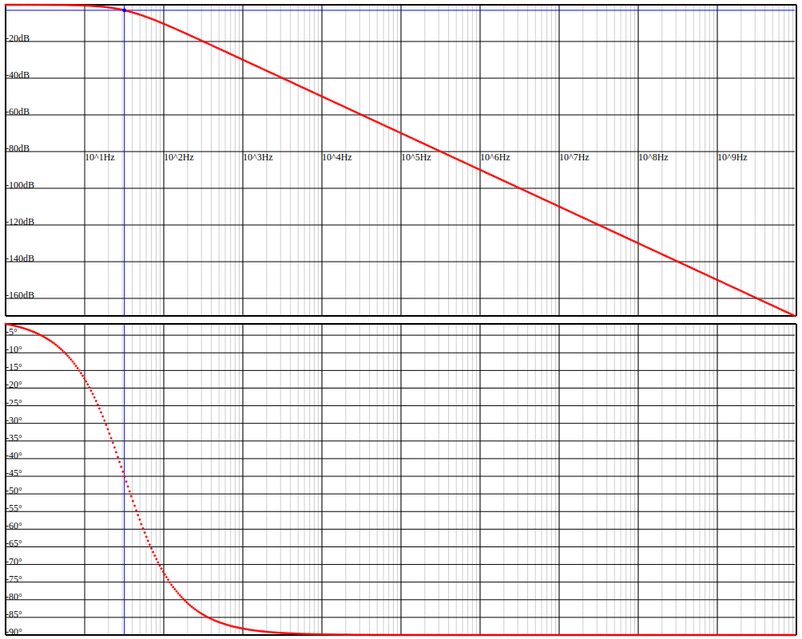

# zcalc

**Note**: Just a hobby project to combine my programming skills with my electrical engineering skills. Functionality is not verified.

This little library lets the users specify electrical networks consisting of passive components (L, C and R). The response of the network can be calculated for a given frequency. The plotter calculates the frequency response for multiple frequencies and creates a the Bode plot for the network in an SVG format embedded in HTML so that it can be opened using any browser.

E.g.:

```
    zcalc::Network rc_net { };
    rc_net.add_resistor("R", 50.0, "in", "out");
    rc_net.add_capacitor("C", 100.0e-6, "out", "gnd");

    zcalc::Plotter plotter {};
    plotter.plot("rc_element", rc_net);
```

